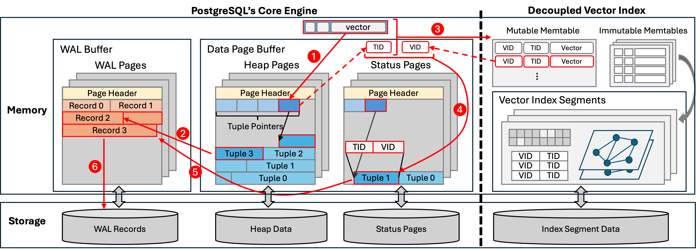
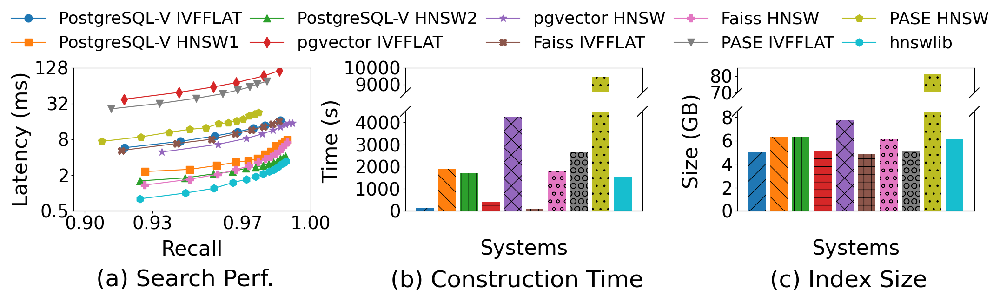
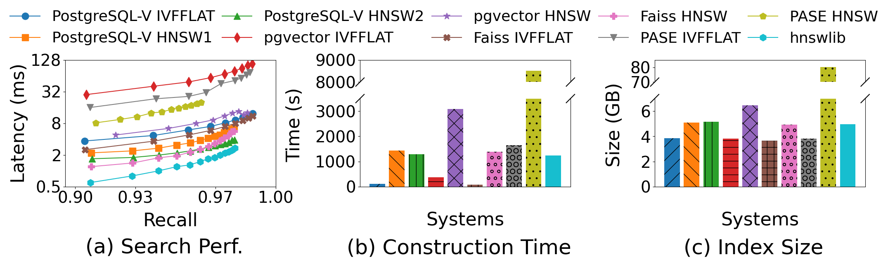

# PostgreSQL-V
**Open-Source Vector Similarity Search for PostgreSQL**

## Introduction

**PostgreSQL-V** is a new integrated vector database system developed by **Purdue Database Group** that enables fast vector search in PostgreSQL. It achieves performance on par with specialized vector databases.

Unlike prior systems (e.g., [pgvector](https://github.com/pgvector/pgvector)) that inherits legacy overhead by reusing PostgreSQL’s page-oriented structure, PostgreSQL-V adopts a novel architectural design that decouples vector indexes from PostgreSQL’s core engine. This decoupling offers many benefits, such as directly leveraging native vector index libraries for high performance. However, it also introduces the challenge of index inconsistency, which we address with a lightweight consistency mechanism.

PostgreSQL-V is fully compatible with pgvector (by implementing the same APIs in IndexAmRoutine), making it a viable drop-in replacement.

## Installation
### 1. Install PostgreSQL
Follow the official [PostgreSQL installation guide](https://www.postgresql.org/download/) for your operating system.

### 2. Build and Install the Extension
```bash
cd postgresqlv
vim ./install_pgvector.sh
```
Locate the line starting with:
```
PG_CONFIG=
```
and update it to point to your local pg_config path. Then run:
```bash
./install_pgvector.sh
```

## Getting Started
PostgreSQL-V is fully compatible with pgvector.
You can follow pgvector's [user tutorial](https://github.com/pgvector/pgvector) to get started with basic usage and examples.

## Architecture Overview
The following figure illustrates the high-level architecture of PostgreSQL-V.

(Details of the design will be provided in our upcoming CIDR paper; the link will be added here once available.)


## Experiment Overview
**SIFT10M**

**DEEP10M**


## Note
⚠️The `main` branch is currently under active development.  

For an executable prototype, please switch to the [cidr branch](https://github.com/purduedb/PostgreSQL-V/tree/cidr), which contains the version used in our CIDR submission to validate the proposed design.

## Citation
If you find our system useful for your research, please cite the following paper:

@inproceedings{PostgreSQLV-CIDR26,
  title = ,
  author={Jiayi Liu and Yunan Zhang and Chenzhe Jin and Aditya Gupta and Shige Liu and Jianguo Wang},
  booktitle={Conference on Innovative Data Systems Research (CIDR)},
  year={2026}
}

## Contact
If you have any questions, you are more than welcome to contact Dr. [Jianguo Wang](https://cs.purdue.edu/homes/csjgwang/)
